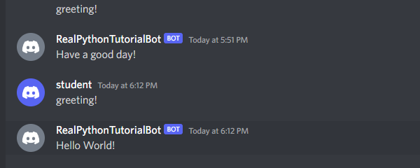

  - Setup
    - dependencies (what packages need to be installed to run the project)
		- sudo apt install python3.8
		- sudo apt install python3.8-pip
		- sudo apt update
		- pip3 install -U discord.py
		- pip3 install -U python-dotenv
		- python3.8 -m pip install --upgrade pip
		- python3.8 -m pip install -U discord.py==2.0.1
    - how to get an API token
		- Using discord's developer panel, we use 0Auth2 URL Generator which generates an authorization URL that hits Discord’s OAuth2 API and authorizes API access using your application’s credentials. 
    - where to put it to work with the code
		- The API token is a secret token. It must be in the same directory as the bot.py file. However, our API token is in a .env file which is will be incorporated into a .gitignore file.
  - Usage
    - with your changes to the code in place, describe
      - what commands you can type in your Discord server
		- 'greeting!'
      - what response this will provide (from your bot)
		- 'Hello World!'
        - 'Hey!'
        - 'Have a good day!'
    - screenshots are welcome here
		- 
  - Research
    - you may have realized that it is lame that the bot only runs when you run the program - it turns off if you disconnect or need to switch tasks.
    - In the real world, things are "always on", not waiting for Bob to turn his PC on and make sure the program is running.
    - **Research** some possible solutions that would solve this, and discuss why you think it would work.
		- Since we can't keep our PC on 24/7, the next best solution is to use a Virtual Private Server or a dedicated server of some sort. I've seen people using old devices (remote hosting). Moreover, there are services that offer 24/7 uptime for a free or a small fee.
	