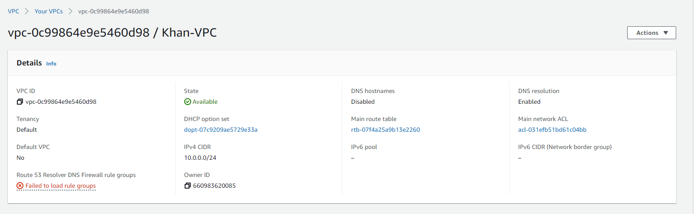
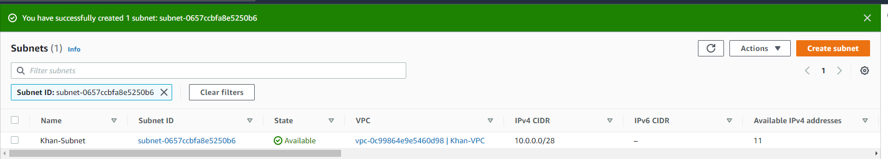
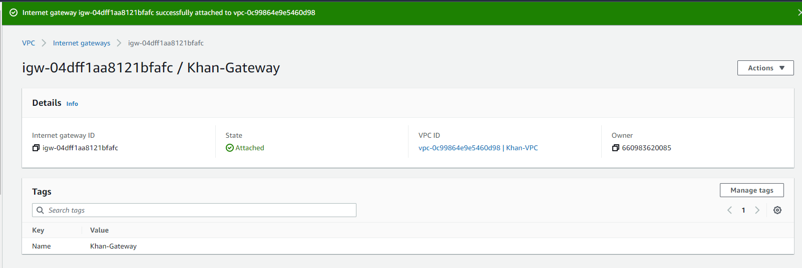
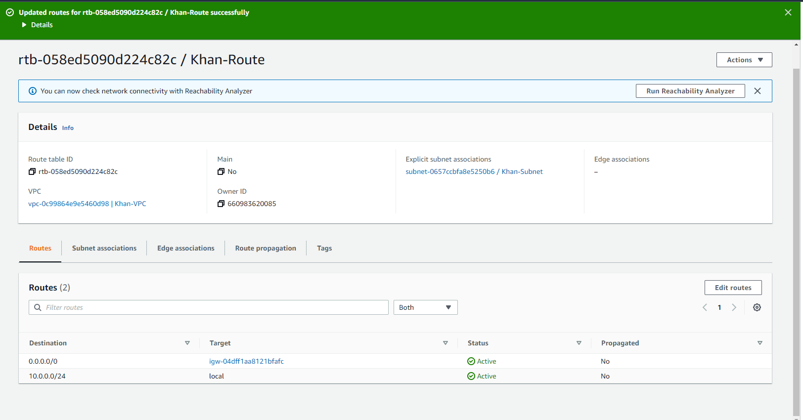
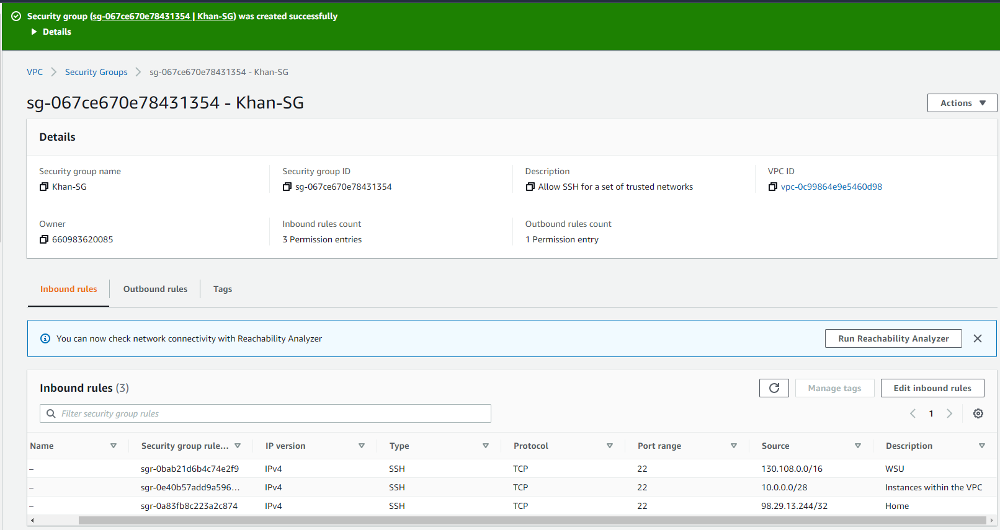
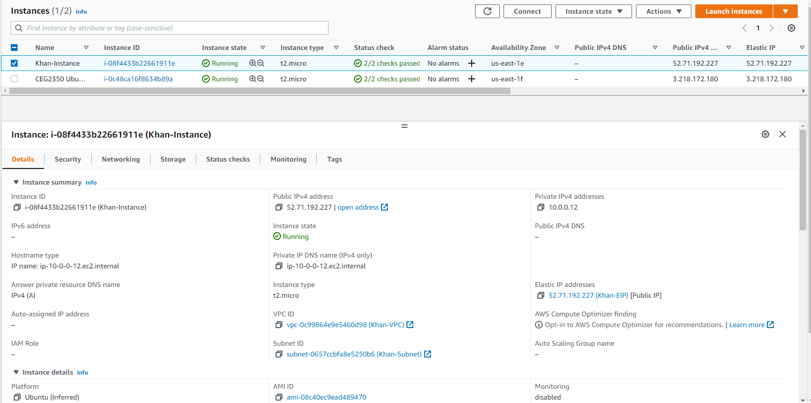
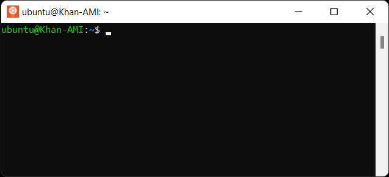

## Part 1
- 
  - Virtual Private Cloud
    - Virtual network dedicated to your AWS system. Resembles a traditional network.
- 
  - Subnet
    - Range of IP addresses in your VPC. Network inside a Network.  Logical subdivision of an IP network.
- 
  - Internet Gateway
    - Gateway to attach to the VPC to enable communication between recourse in your VPC and internet. Allows communication between your VPC and the internet.
- 
  - Route Table
    - Set of rules (called routes) that determine where network traffic from your subnet or gateway is directed.
- 
  - Security Group
    - Network firewall, controls the traffic that is allowed to reach and leave the resources that it is associated with.
	
## Part 2
1.
- AMI Selected: ami-08c40ec9ead489470
- Instace Type Selected: t.2 micro
2. When launching instances, edit network settings. Under VPC-required choose Khan-VPC. This will attach the instance to your VPC.
3. Auto-assigning an IPV4 address to the instance is the way to go. They'll be chosen from Amazon's pool of IPv4 addresses. The other options require you to provide your own public IP or a customer owned pool of IPV4 addresses. These also come with their own requirements and quotas.
4. When launching instances, edit configure storage. Select: 1x 8 Gib | General purpose SSD (gp2) Root volume | (this is also the default config).
5. When launching instances, edit name and tags. Under name type in Khan-Instance. You've now added a tag with your "Name" to your instance.
6. When launching instances, edit network settings. After you've chosen the correct VPC go to the Firewall (security groups) section. Select existing security group and and under common security groups chose your security group (Khan-VPC). 
7. When launching allocate elastic IP address, leave everything default. However, under tags type "Name" for key and "Khan-EIP" under Value for indentification purposes. Next, select your new EIP and click the associate elastic IP address tab. Under instance choose your current instance (Khan-Instance). Under private IP address you are able to auto select the private IP address. The reason for this is because when the machine got created, it chose for itself, a private IP address on that network.
8. 
9. First, back up your old hostname into a new file called hostname.old. Second, type in `sudo hostnamectl set-hostname Khan-AMI` which will permanently change your hostname next time you open your system.
10. 