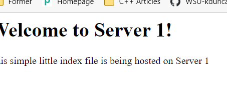
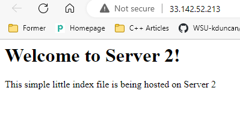

## Part 2 - Setup Load Balancing TODOs

**Using the instances created by your CloudFormation template, setup the following and add documentation or screenshots to your `README.md` file as specified.**

1. Create an `/etc/hosts` OR `.ssh/config` file on each system that correlates hostnames to private IPs of systems within the subnet (your instances).
	- Description of how file is configured
		- Both webserv1 and webserv2 have private IPs allocated to them. (Edited /etc/hosts)
```
10.0.1.10 webserv1
10.0.1.11 webserv2
```
2. Document how to SSH in between the systems utilizing their private IPs.
	- A config is altered (/etc/hosts) that will allow us to SSH between instances. 
		- The private IP will be associated and that will allow us to use an alias.
`ssh -i ().pem webserv1`
3. **_HAProxy configuration & documentation requirements_**
- How to set up a HAProxy load balancer
 - What file(s) where modified & their location
```
The haproxy.cfg file was modified & and it is located in /etc/haproxy
 ```
 - What configuration(s) were set (if any)
```
frontend haproxy-main
	bind 10.0.0.10:80
	default_backend web_servers 
backend webservers
	balance roundrobin
	server webserv1 10.0.1.10:80 check
	server webserv2 10.0.1.11:80 check
```
 - How to restart the service after a configuration change
```
 sudo systemctl restart haproxy
 ```
- Resources used (websites)
 ```
 https://www.haproxy.com/blog/the-four-essential-sections-of-an-haproxy-configuration/
 https://linuxhint.com/how-to-install-and-configure-haproxy-load-balancer-in-linux/
 ```
4. **_Webserver 1 & 2 configuration & documentation requirements_**
   - How set up a webserver
     - What file(s) were modified & their location
	 ```
	The index.html file was modified & and it is located in /var/www/html
	 ```
     - What configuration(s) were set (if any)
	 ```
	 N/A
	 ```	 
     - Where site content files were located (and why)
	 ```
	 The content files were located in the /var/www/html directory and this is because it is the directory for our webserver
	 ```	 
     - How to restart the service after a configuration change
	 ```
	 sudo systemctl restart apache2
	 ```	 
     - Resources used (websites)
	 ```
	 https://www.digitalocean.com/community/tutorials/how-to-install-the-apache-web-server-on-ubuntu-20-04
	 ```	 
5. From the browser, when connecting to the proxy server, take two screenshots.
   - one screenshot that shows content from "server 1"
   - 
   - one screenshot that shows content from "server 2"
   - 